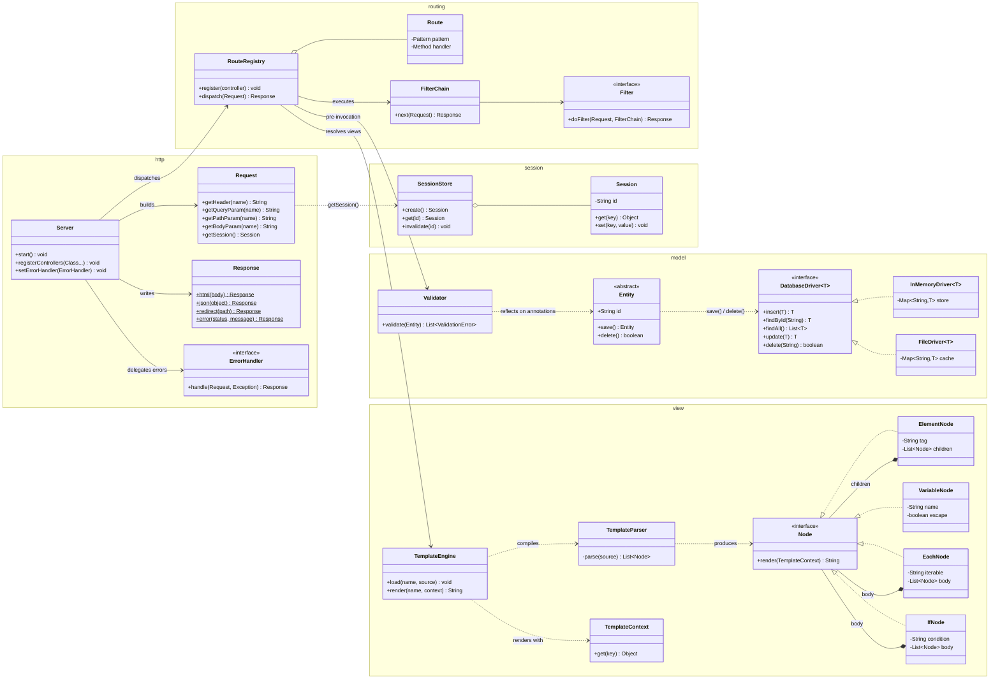

# UML

```mermaid
classDiagram
    direction LR

    namespace http {
        class Server {
            +start() void
            +registerControllers(Class...) void
            +setErrorHandler(ErrorHandler) void
        }
        class Request {
            +getHeader(name) String
            +getQueryParam(name) String
            +getPathParam(name) String
            +getBodyParam(name) String
            +getSession() Session
        }
        class Response {
            +html(body)$ Response
            +json(object)$ Response
            +redirect(path)$ Response
            +error(status, message)$ Response
        }
        class ErrorHandler {
            <<interface>>
            +handle(Request, Exception) Response
        }
    }

    namespace routing {
        class RouteRegistry {
            +register(controller) void
            +dispatch(Request) Response
        }
        class Route {
            -Pattern pattern
            -Method handler
        }
        class Filter {
            <<interface>>
            +doFilter(Request, FilterChain) Response
        }
        class FilterChain {
            +next(Request) Response
        }
    }

    namespace session {
        class SessionStore {
            +create() Session
            +get(id) Session
            +invalidate(id) void
        }
        class Session {
            -String id
            +get(key) Object
            +set(key, value) void
        }
    }

    namespace model {
        class Entity {
            <<abstract>>
            +String id
            +save() Entity
            +delete() boolean
        }
        class DatabaseDriver~T~ {
            <<interface>>
            +insert(T) T
            +findById(String) T
            +findAll() List~T~
            +update(T) T
            +delete(String) boolean
        }
        class InMemoryDriver~T~ {
            -Map~String,T~ store
        }
        class FileDriver~T~ {
            -Map~String,T~ cache
        }
        class Validator {
            +validate(Entity) List~ValidationError~
        }
    }

    namespace view {
        class TemplateEngine {
            +load(name, source) void
            +render(name, context) String
        }
        class TemplateParser {
            -parse(source) List~Node~
        }
        class TemplateContext {
            +get(key) Object
        }
        class Node {
            <<interface>>
            +render(TemplateContext) String
        }
        class ElementNode {
            -String tag
            -List~Node~ children
        }
        class VariableNode {
            -String name
            -boolean escape
        }
        class EachNode {
            -String iterable
            -List~Node~ body
        }
        class IfNode {
            -String condition
            -List~Node~ body
        }
    }

    %% --- Framework internals ---
    Server --> Request : builds
    Server --> Response : writes
    Server --> ErrorHandler : delegates errors
    Server --> RouteRegistry : dispatches
    RouteRegistry o-- Route
    RouteRegistry --> FilterChain : executes
    FilterChain --> Filter
    RouteRegistry --> TemplateEngine : resolves views
    RouteRegistry --> Validator : pre-invocation
    SessionStore o-- Session
    Request ..> SessionStore : getSession()
    Validator ..> Entity : reflects on annotations
    Entity ..> DatabaseDriver~Entity~ : save() / delete()
    DatabaseDriver~T~ <|.. InMemoryDriver~T~
    DatabaseDriver~T~ <|.. FileDriver~T~

    %% --- Template AST (Composite) ---
    TemplateEngine ..> TemplateParser : compiles
    TemplateParser ..> Node : produces
    Node <|.. ElementNode
    Node <|.. VariableNode
    Node <|.. EachNode
    Node <|.. IfNode
    ElementNode *-- Node : children
    EachNode *-- Node : body
    IfNode *-- Node : body
    TemplateEngine ..> TemplateContext : renders with
```
