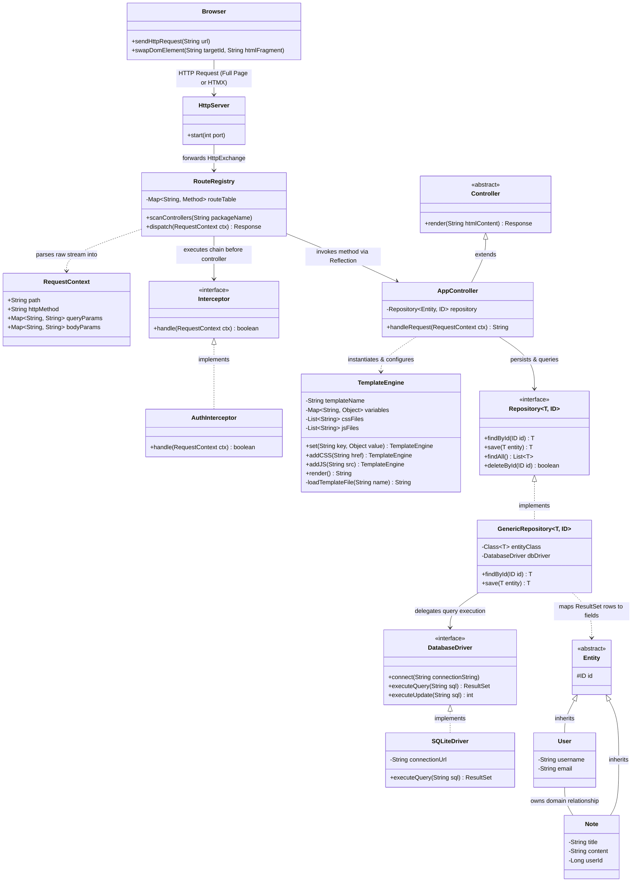

```mermaid
classDiagram
    direction TB

    %% 1. Client Browser Boundary
    class Browser {
        +sendHttpRequest(String url)
        +swapDomElement(String targetId, String htmlFragment)
    }

    %% 2. Network & Routing Infrastructure (Front Controller Pattern)
    class HttpServer {
        +start(int port)
    }

    class RouteRegistry {
        -Map~String, Method~ routeTable
        +scanControllers(String packageName)
        +dispatch(RequestContext ctx) Response
    }

    class RequestContext {
        +String path
        +String httpMethod
        +Map~String, String~ queryParams
        +Map~String, String~ bodyParams
    }

    Browser --> HttpServer : HTTP Request (Full Page or HTMX)
    HttpServer --> RouteRegistry : forwards HttpExchange
    RouteRegistry ..> RequestContext : parses raw stream into

    %% 3. Middleware Interceptor Chain (Chain of Responsibility Pattern)
    class Interceptor {
        <<interface>>
        +handle(RequestContext ctx) boolean
    }

    class AuthInterceptor {
        +handle(RequestContext ctx) boolean
    }

    Interceptor <|.. AuthInterceptor : implements
    RouteRegistry --> Interceptor : executes chain before controller

    %% 4. Controller Layer
    class Controller {
        <<abstract>>
        +render(String htmlContent) Response
    }

    class AppController {
        -Repository~Entity, ID~ repository
        +handleRequest(RequestContext ctx) String
    }

    Controller <|-- AppController : extends
    RouteRegistry --> AppController : invokes method via Reflection

    %% 5. Simplified Template Engine (View Layer)
    class TemplateEngine {
        -String templateName
        -Map~String, Object~ variables
        -List~String~ cssFiles
        -List~String~ jsFiles
        +set(String key, Object value) TemplateEngine
        +addCSS(String href) TemplateEngine
        +addJS(String src) TemplateEngine
        +render() String
        -loadTemplateFile(String name) String
    }

    AppController ..> TemplateEngine : instantiates & configures

    %% 6. Database Persistence Layer (Strategy Pattern & Generics)
    class Repository~T, ID~ {
        <<interface>>
        +findById(ID id) T
        +save(T entity) T
        +findAll() List~T~
        +deleteById(ID id) boolean
    }

    class GenericRepository~T, ID~ {
        -Class~T~ entityClass
        -DatabaseDriver dbDriver
        +findById(ID id) T
        +save(T entity) T
    }

    class DatabaseDriver {
        <<interface>>
        +connect(String connectionString)
        +executeQuery(String sql) ResultSet
        +executeUpdate(String sql) int
    }

    class SQLiteDriver {
        -String connectionUrl
        +executeQuery(String sql) ResultSet
    }

    class Entity {
        <<abstract>>
        #ID id
    }

    class User {
        -String username
        -String email
    }

    class Note {
        -String title
        -String content
        -Long userId
    }

    AppController --> Repository : persists & queries
    Repository <|.. GenericRepository : implements
    DatabaseDriver <|.. SQLiteDriver : implements
    GenericRepository --> DatabaseDriver : delegates query execution
    GenericRepository ..> Entity : maps ResultSet rows to fields

    Entity <|-- User : inherits
    Entity <|-- Note : inherits
    User -- Note : owns domain relationship
```
